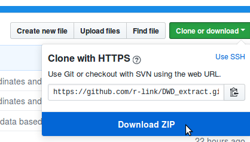

```{r setup, include=FALSE}
knitr::opts_chunk$set(echo = TRUE)
```

## Description
The Deutsche Wetterdienst (DWD) offers a large amount of freely accessible climate information on its website ([Climate Data Center](https://www.dwd.de/EN/climate_environment/cdc/cdc_node.html)). 

The climate information can either be accessed on the level of individual climate stations, or in the form of spatial predictions compressed as ASCII grids (*.asc.gz files) on a $1 \times 1$ m² resolution. These grids with climate information are very valuable as they enable to extract climate information for any location in Germany, and thus to obtain site-specific climate information for research sites anywhere in the country. 

As this is a common task within [our department](http://plantecology.uni-goettingen.de), the present project attempts to streamline the extraction, processing and aggregation of climate information for a set of plot coordinates. With simple modifications, the same scripts can also be used to extract site-specific information from any other kind of raster dataset (e.g. [WorldClim data](http://www.worldclim.org/) etc.).

## Getting the DWD raw data
As it would be rather time-consuming to remotely access the DWD datasets from within an R script, the easiest solution is to batch download them all from the FTP server (there are Browser extentions that make this task very easy, such as [DownThemAll](https://addons.mozilla.org/de/firefox/addon/downthemall/) for Mozilla Firefox). _It is also planned to store the datasets in the exchange folder of our department_. 

After downloading the files, batch unpack the *.asc.gz files (can be done by most file archiving software by selecting a list of files, right-clicking and marking "extract here") and delete the original compressed files. 

In the present example, we worked with monthly averages of precipitation. We decided to keep the folder structure of the original dataset (grids for all years separated into folders by months), but it would also be possible (and even easier to handle) to store all grids in the same folder (I decided not to do so because this way I can use the script to show how to deal with stacks of rasters of different types that are stored in different folders).

As it would be impossible to store the complete dataset (almost 5 GB) on GitHub, the folder `/grids` contains samples of each 3 grids for all months as an example to show how to deal with this type of datasets.

## Setting up an R project
To download a local copy of the present project onto your computer, click on the "clone or download" button in the upper right corner of this GitHub page and choose "Download ZIP"."



When the file is downloaded, unpack it to your desired project directory. 
You can then run `example_script.R` to test if everything works on your system. If you are working with [RStudio](https://www.rstudio.com/), you can open the R project file `DWD_extract.Rproj`, which automatically sets the working directory to the project directory. If you are using a different editor, you will have to do this by hand before running the script.

The following sections will explain step by step what is going on in `example_script.R`, and show you how to modify this script to use it for your own purposes. 

ADD TREE WITH FOLDER STRUCTURE HERE!

## Installation of GDAL and PROJ.4
As this script is based on the `raster` package, which itself relies on the 
[Geospatial Data Abstraction Library (GDAL)](http://www.gdal.org/) and (PROJ.4=[http://proj4.org/], GDAL and PROJ.4 have to be installed before being able to run the script.

In case you are working with Linux, GDAL and PROJ.4 can be installed by opening a shell and entering:

```{r, engine ='bash', eval = FALSE}
sudo apt-get update && sudo apt-get install libgdal-dev libproj-dev

```

Depending on the distribution you are working with, in some cases you might need a newer version of `libgdal-dev` than the version available in the repositories. If you are using Ubuntu and encounter error messages regarding the version of GDAL, you can try to add the [ubuntugis-unstable](https://launchpad.net/~ubuntugis/+archive/ubuntu/ubuntugis-unstable) PPA to your system's repositories (keep in mind that this installs unsupported, experimental packages from an untrusted PPA and might hence be dangerous).

```{r, engine ='bash', eval = FALSE}
sudo add-apt-repository ppa:ubuntugis/ubuntugis-unstable
sudo apt-get update
```       

If you are working with Windows, there are several possible ways to install GDAL and PROJ.4, for instance by installing [GISInternals](http://www.gisinternals.com/). Other options are offered on the corresponding websites.

## Working with example_script.R
The next sections describe the different components of `example_script.R`, and show how to run it. Assuming you're working with [RStudio](https://www.rstudio.com/), you can simply open the .Rproj file and `example_script.R`, and then follow the instructions step by step.

### Preparation
First, the packages needed for the analysis have to be loaded. Here's a nice bit of code that checks if all of them are installed, and installs them if they are not available:
```{r preparation1, cache = TRUE, results = 'hide'}
# create list of packages
pkgs <-c("tidyverse", "rgdal", "raster", "gdalUtils")  
# check for existence of packages and install if necessary
to_install<-pkgs[!(pkgs %in% installed.packages()[,1])]
if (length(to_install)>0)  for (i in seq(to_install)) install.packages(to_install[i])
# load all required packages
for (i in pkgs) require(i, character.only = T)

```
The package `tidyverse` is a wrapper around a list of a large amount of very useful packages (e.g. `dplyr`, `purrr`, `ggplot2` and `readr`) that together form a consistent framework for data handling and management. `rgdal` allows R to access the functionalities of the GDAL library, `raster` is a package for efficient raster file handling and `gdalUtils` is used to read CRS strings from .prj files.

### Load plot coordinates 
The dataset with the plot coordinates is stored in `/data/csv`. It can be loaded with
```{r coord1, cache = TRUE, results = 'hide'}
coord <- read_csv("data/csv/Coordinates.csv")
```

Note that I load the dataset with `readr::read_csv()` instead of `utils::read.csv()`. This loads the coordinates in the `tibble` format, which prints more beatifully than a regular `data.frame`:
```{r coord2, cache = TRUE}
coord
```

The function `SpatialPointsDataFrame()` can be used to convert `coord` into an object with explicit spatial information:
```{r coord3, cache = TRUE, results = 'hide'}
coord1 <- SpatialPointsDataFrame(coords = coord[,4:3], data = coord, 
                                 proj4string = CRS("+proj=longlat +datum=WGS84 +no_defs +ellps=WGS84 +towgs84=0,0,0"))
```

The `proj4string` is a coordinate reference system as provided by the PROJ.4 library (in this case, latitude/longitude as decimal degrees). Note that I specified `coords = coord[,4:3]` - the order of the coordinates had to be reversed because longitude has to come first.


### Loading and handling raster files
to easily work with the contents of the grids folder, it is useful to be able
to work with the list.files() function (which lists the contents of a folder)

get directory of a grid with precipitation data using list.files()

```{r raster1, cache = TRUE}
first <- list.files("grids/precipitation/jan", full.names = TRUE)[1]
```
full.names = TRUE assures that the entire path is returned):
first this is the path to the grid with precipitation data for january
      for the first year in the interval spanned by the DWD data

it is easy to load the corresponding .asc file with raster()

```{r raster1, cache = TRUE}
r1 <- raster(first)
r1 
```
unfortunately, the file has the wrong projection (coord. ref. : NA)

the correct coordinate reference system is stored in grids/projection.prj
and can be converted to a CRS object with gdalUtils::gdalsrsinfo

```{r raster1, cache = TRUE}
proj <- gdalsrsinfo("grids/projection.prj", as.CRS = TRUE)
proj
```
the file can be loaded again using the correct CRS information

```{r raster1, cache = TRUE}
r2 <- raster(first, crs = proj)
r2
```
the raster file can be plotted to inspect if it was loaded correctly

```{r raster1, cache = TRUE}
plot(r2)
```
in order to extract information for the site coordinates, they have to
be transformed to the same coordinate system 

```{r raster1, cache = TRUE}
coord2 <- spTransform(coord1, CRS = proj)
```
it is easy to stack a large list of rasters instead of just loading a 
single raster dataset at a time

first, list all files in one folder (in this example, precipitation for 
january)

```{r raster1, cache = TRUE}
files <- list.files("grids/precipitation/jan", full.names = TRUE)
head(files)
```
load all rasters for january as a stack

```{r raster1, cache = TRUE}
jan <- stack(files)
jan
```

the layers in the stacks take their names from the .asc objects
in the corresponding folder

for stacks of files, for some reason the coordinate reference has to be
set manually after loading 

```{r raster1, cache = TRUE}
projection(jan) <- proj
jan 
```
now the coord. ref. is correct

raster stacks can be easily plotted (don't do this when they have lots of layers!)

```{r raster1, cache = TRUE}
plot(jan)
```
data for specific coordinates can be extracted from a raster of raster stack 
with the extract function

```{r raster1, cache = TRUE}
extr <- extract(jan, coord2)
```
...and then be combined with plot information

```{r raster1, cache = TRUE}
data <- data.frame(coord, extr)
data
```
