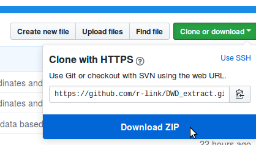

Extract climate information from grids from the DWD Climate Data Center
================

Description
-----------

The Deutsche Wetterdienst (DWD) offers a large amount of freely accessible climate information on its website ([Climate Data Center](https://www.dwd.de/EN/climate_environment/cdc/cdc_node.html)).

The climate information can either be accessed on the level of individual climate stations, or in the form of spatial predictions compressed as ASCII grids (\*.asc.gz files) on a 1 × 1 m² resolution. These grids with climate information are very valuable as they enable to extract climate information for any location in Germany, and thus to obtain site-specific climate information for research sites anywhere in the country.

As this is a common task within [our department](http://plantecology.uni-goettingen.de), the present project attempts to streamline the extraction, processing and aggregation of climate information for a set of plot coordinates. With simple modifications, the same scripts can also be used to extract site-specific information from any other kind of raster dataset (e.g. [WorldClim data](http://www.worldclim.org/) etc.).

Getting the DWD raw data
------------------------

As it would be rather time-consuming to remotely access the DWD datasets from within an R script, the easiest solution is to batch download them all from the FTP server (there are Browser extentions that make this task very easy, such as [DownThemAll](https://addons.mozilla.org/de/firefox/addon/downthemall/) for Mozilla Firefox). *It is also planned to store the datasets in the exchange folder of our department*.

After downloading the files, batch unpack the \*.asc.gz files (can be done by most file archiving software by selecting a list of files, right-clicking and marking "extract here") and delete the original compressed files.

In the present example, we worked with monthly averages of precipitation. We decided to keep the folder structure of the original dataset (grids for all years separated into folders by months), but it would also be possible (and even easier to handle) to store all grids in the same folder (I decided not to do so because this way I can use the script to show how to deal with stacks of rasters of different types that are stored in different folders).

As it would be impossible to store the complete dataset (almost 5 GB) on GitHub, the folder `/grids` contains samples of each 3 grids for all months as an example to show how to deal with this type of datasets.

Setting up an R Project
-----------------------

To download a local copy of the present project onto your computer, click on the "clone or download" button in the upper right corner of this GitHub page and choose "Download ZIP"."

When the file is downloaded, unpack it to your desired project directory. You can then run `example_script.R` to test if everything works on your system. If you are working with RStudio, you can open the R project file `DWD_extract.Rproj`, which automatically sets the working directory to the project directory; else you will have to do this by hand before running the script.

The following sections will explain step by step what is going on in `example_script.R`, and show you how to modify this script to use it for your own purposes.

ADD TREE WITH FOLDER STRUCTURE HERE!
