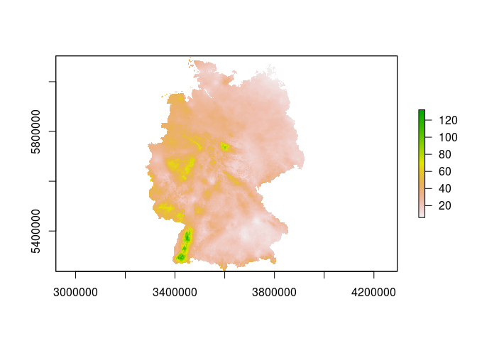
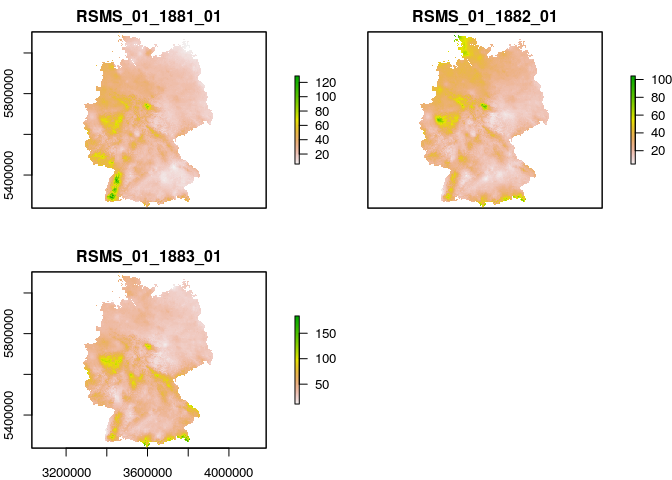

Extract climate information from grids from the DWD Climate Data Center
================

Description
-----------

The Deutsche Wetterdienst (DWD) offers a large amount of freely accessible climate information on its website ([Climate Data Center](https://www.dwd.de/EN/climate_environment/cdc/cdc_node.html)).

The climate information can either be accessed on the level of individual climate stations, or in the form of spatial predictions stored as compressed ASCII grids (\*.asc.gz files) on a 1 × 1 km² resolution. These grids with climate information are very valuable as they enable to extract climate information for any location in Germany, and thus to obtain site-specific climate information for research sites anywhere in the country.

As this is a common task within [our department](http://plantecology.uni-goettingen.de), the present project attempts to streamline the extraction, processing and aggregation of climate information for a set of plot coordinates. With simple modifications, the same scripts can also be used to extract site-specific information from any other kind of raster dataset (e.g. [WorldClim data](http://www.worldclim.org/) etc.).

TL/DR
-----

**Note to advanced users:** This tutorial explains how to loop over various folders with multiple raster datasets, load them with `raster::stack()`, and export plot-level information with `raster::extract()`, so if this sounds familiar to you don't waste your time.

Getting the DWD raw data
------------------------

As it would be rather time-consuming to remotely access the DWD datasets from within an R script, the easiest solution is to batch download them all from the FTP server (there are Browser extentions that make this task very easy, such as [DownThemAll](https://addons.mozilla.org/de/firefox/addon/downthemall/) for Mozilla Firefox). *It is also planned to store the datasets in the exchange folder of our department*.

After downloading the files, batch unpack the \*.asc.gz files (can be done by most file archiving software by selecting a list of files, right-clicking and marking "extract here") and delete the original compressed files.

In the present example, we worked with monthly averages of precipitation. We decided to keep the folder structure of the original dataset (grids for all years separated into folders by months), but it would also be possible (and even easier to handle) to store all grids in the same folder (I decided not to do so because this way I can use the script to show how to deal with stacks of rasters of different types that are stored in different folders).

As it would be impossible to store the complete dataset (almost 5 GB) on GitHub, the folder `/grids` contains samples of each 3 grids for all months as an example to show how to deal with this type of datasets.

Setting up an R project
-----------------------

To download a local copy of the present project onto your computer, click on the "clone or download" button in the upper right corner of this GitHub page and choose "Download ZIP"."


When the file is downloaded, unpack it to your desired project directory. You can then run `example_script.R` to test if everything works on your system. If you are working with [RStudio](https://www.rstudio.com/), you can open the R project file `DWD_extract.Rproj`, which automatically sets the working directory to the project directory. If you are using a different editor, you will have to do this by hand before running the script.

The following sections will explain step by step what is going on in `example_script.R`, and show you how to modify this script to use it for your own purposes.

Project structure
-----------------

``` text
/             -- top level files:
/example_script.R  -- example for the workflow
/DWD_extract.Rproj -- RStudio project file
/README.Rmd        -- R Markdown file for the README on GitHub
/README.md         -- compiled R Markdown file

/data/raw     -- folder with .xls(x)-files with raw data
/data/csv     -- folder with .csv versions of the raw data tables
/grids        -- folder with the grids with the DWD data
  /precipitation  -- DWD precipitation data
     /jan           -- folders for the .asc grids with monthly 
     /feb              averages of precipitation data
     /...
/figures      -- figures (so far only screenshot for README file)
/output       -- .csv file with the extracted precipitation data
/README_cache -- cached data for README.Rmd file
/README_files -- generated objects in README.Rmd file
```

Installation of GDAL and PROJ.4
-------------------------------

As this script is based on the `raster` package, which itself relies on the [Geospatial Data Abstraction Library (GDAL)](http://www.gdal.org/) and [PROJ.4](http://proj4.org/), GDAL and PROJ.4 have to be installed before being able to run the script.

In case you are working with Linux, GDAL and PROJ.4 can be installed by opening a shell and entering:

``` bash
sudo apt-get update && sudo apt-get install libgdal-dev libproj-dev
```

Depending on the distribution you are working with, in some cases you might need a newer version of `libgdal-dev` than the version available in the repositories (in my case, this only happened with the `sp` package, but you newer know...). If you are using Ubuntu and encounter error messages regarding the version of GDAL, you can try to add the [ubuntugis-unstable](https://launchpad.net/~ubuntugis/+archive/ubuntu/ubuntugis-unstable) PPA to your system's repositories (keep in mind that this installs unsupported, experimental packages from an untrusted PPA and might hence be dangerous).

``` bash
sudo add-apt-repository ppa:ubuntugis/ubuntugis-unstable
sudo apt-get update
```

If you are working with Windows, there are several possible ways to install GDAL and PROJ.4, for instance by installing [GISInternals](http://www.gisinternals.com/). Other options are offered on the corresponding websites (e.g., see the list in the "Windows" section at the bottom of [this page](http://trac.osgeo.org/gdal/wiki/DownloadingGdalBinaries)).

Working with example\_script.R
------------------------------

The next sections describe the different components of `example_script.R`, and show how to run it. Assuming you're working with [RStudio](https://www.rstudio.com/), you can simply open the .Rproj file and `example_script.R`, and then follow the instructions step by step.

### Preparation

First, the packages needed for the analysis have to be loaded. Here's a nifty bit of code that checks if all of them are installed, and installs them only if they are not available:

``` r
# create list of packages
pkgs <-c("tidyverse", "lubridate", "rgdal", "raster", "gdalUtils")  
# check for existence of packages and install if necessary
to_install <- pkgs[!(pkgs %in% installed.packages()[, 1])]
if (length(to_install) > 0)  for (i in seq(to_install)) install.packages(to_install[i])
# load all required packages
for (i in pkgs) require(i, character.only = T)
```

The package `tidyverse` is a wrapper around a list of a large amount of very useful packages (e.g. `dplyr`, `purrr`, `ggplot2` and `readr`) that together form a consistent framework for data handling and management. `lubridate` is helpful when working with times and dates, and in this script is only used to get a correct timestamp on the output files. `rgdal` allows R to access the functionalities of the GDAL library, `raster` is a package for efficient raster file handling and `gdalUtils` is a package with useful GDAL-related functions (in this case only used to read CRS strings from .prj files).

### Load plot coordinates

The dataset with the plot coordinates is stored in `/data/csv`. It can be loaded with

``` r
coord <- read_csv("data/csv/Coordinates.csv")
```

    ## Parsed with column specification:
    ## cols(
    ##   site = col_character(),
    ##   species = col_character(),
    ##   latitude = col_double(),
    ##   longitude = col_double()
    ## )

Note that I load the dataset with `readr::read_csv()` instead of `utils::read.csv()`. This loads the coordinates in the `tibble` format, which prints more beatifully than a regular `data.frame`:

``` r
coord
```

    ## # A tibble: 34 x 4
    ##     site species latitude longitude
    ##    <chr>   <chr>    <dbl>     <dbl>
    ##  1    RH      WL 51.59920  10.00921
    ##  2    RH      ES 51.59129  10.00793
    ##  3    RH      SA 51.59129  10.00793
    ##  4    HR      TE 51.59420  10.07873
    ##  5    HR      HB 51.59420  10.07873
    ##  6    KB      SA 51.54180   9.80909
    ##  7    KB      ES 51.54180   9.80909
    ##  8    KB      HB 51.54180   9.80909
    ##  9    LB      TE 51.97858  10.43567
    ## 10    LB      SA 51.97938  10.43071
    ## # ... with 24 more rows

The function `SpatialPointsDataFrame()` can be used to convert `coord` to an object with explicit spatial information:

``` r
coord1 <- SpatialPointsDataFrame(coords = coord[,4:3], data = coord, 
                                 proj4string = CRS("+proj=longlat +datum=WGS84 +no_defs +ellps=WGS84 +towgs84=0,0,0"))
```

The `proj4string` is a coordinate reference system as provided by the PROJ.4 library (in this case, latitude/longitude as decimal degrees). Note that I specified `coords = coord[,4:3]` - the order of the coordinates had to be reversed because longitude has to come first.

### Loading and handling raster files

To easily work with the contents of the grids folder, it is useful to be able to work with the `list.files()` function (which lists the contents of a folder).

We can use `list.files()` to get the path to the grid with the precipitation data for the first month of the first year in the interval spanned by the DWD data:

``` r
first <- list.files("grids/precipitation/jan", full.names = TRUE)[1]
first 
```

    ## [1] "grids/precipitation/jan/RSMS_01_1881_01.asc"

`full.names = TRUE` assures that the entire path is returned.

Individual raster datasets can be loaded with the `raster()` function. It is easy to load the .asc file corresponding to this path with `raster()`:

``` r
r1 <- raster(first)
r1 
```

    ## class       : RasterLayer 
    ## dimensions  : 866, 654, 566364  (nrow, ncol, ncell)
    ## resolution  : 1000, 1000  (x, y)
    ## extent      : 3280415, 3934415, 5237501, 6103501  (xmin, xmax, ymin, ymax)
    ## coord. ref. : NA 
    ## data source : /media/WinData/Projects/2018/2018-01 Sebastian Fuchs dwd/DWD_extract/grids/precipitation/jan/RSMS_01_1881_01.asc 
    ## names       : RSMS_01_1881_01 
    ## values      : -2147483648, 2147483647  (min, max)

Unfortunately, the loaded raster is missing the projection information (`coord. ref. : NA`).

The correct coordinate reference system is stored in `grids/projection.prj` and can be converted to a CRS object using `gdalUtils::gdalsrsinfo()`:

``` r
proj <- gdalsrsinfo("grids/projection.prj", as.CRS = TRUE)
proj
```

    ## CRS arguments:
    ##  +proj=tmerc +lat_0=0 +lon_0=9 +k=1 +x_0=3500000 +y_0=0
    ## +datum=potsdam +units=m +no_defs +ellps=bessel
    ## +towgs84=598.1,73.7,418.2,0.202,0.045,-2.455,6.7

Now the raster can be loaded again using the correct CRS information:

``` r
r2 <- raster(first, crs = proj)
r2 # now the correct coordinate reference system is displayed
```

    ## class       : RasterLayer 
    ## dimensions  : 866, 654, 566364  (nrow, ncol, ncell)
    ## resolution  : 1000, 1000  (x, y)
    ## extent      : 3280415, 3934415, 5237501, 6103501  (xmin, xmax, ymin, ymax)
    ## coord. ref. : +proj=tmerc +lat_0=0 +lon_0=9 +k=1 +x_0=3500000 +y_0=0 +datum=potsdam +units=m +no_defs +ellps=bessel +towgs84=598.1,73.7,418.2,0.202,0.045,-2.455,6.7 
    ## data source : /media/WinData/Projects/2018/2018-01 Sebastian Fuchs dwd/DWD_extract/grids/precipitation/jan/RSMS_01_1881_01.asc 
    ## names       : RSMS_01_1881_01 
    ## values      : -2147483648, 2147483647  (min, max)

It is possible to plot rasters to the R graphics interface, e.g. to inspect if they were loaded correctly:

``` r
plot(r2)
```



The plot coordinates are in a different coordinate reference system (longitude - latitude) than the DWD raster dataset. In order to extract information for the site coordinates, they have to be transformed to the same coordinate system, which can be achieved with `spTransform()`

``` r
coord2 <- spTransform(coord1, CRS = proj)
```

In the original dataset, there are hundreds of rasters with climate information for each month. Fortunately, it is not necessary to access them all separately a single raster dataset at a time because it is easy to stack a large list of rasters all at once. Actually it is not even necessary to use a loop to achieve this...

First, list all files in one folder (in this example, precipitation for January of the first three years):

``` r
files <- list.files("grids/precipitation/jan", full.names = TRUE)
files
```

    ## [1] "grids/precipitation/jan/RSMS_01_1881_01.asc"
    ## [2] "grids/precipitation/jan/RSMS_01_1882_01.asc"
    ## [3] "grids/precipitation/jan/RSMS_01_1883_01.asc"

Now all rasters for January can be loaded as a raster stack:

``` r
jan <- stack(files)
jan
```

    ## class       : RasterStack 
    ## dimensions  : 866, 654, 566364, 3  (nrow, ncol, ncell, nlayers)
    ## resolution  : 1000, 1000  (x, y)
    ## extent      : 3280415, 3934415, 5237501, 6103501  (xmin, xmax, ymin, ymax)
    ## coord. ref. : NA 
    ## names       : RSMS_01_1881_01, RSMS_01_1882_01, RSMS_01_1883_01 
    ## min values  :     -2147483648,     -2147483648,     -2147483648 
    ## max values  :      2147483647,      2147483647,      2147483647

Of course, stacking is only possible if coordinate system, extent and resolution of all rasters in the folder are equal. The layers in the stack take their names from the .asc objects in the corresponding folder. The naming of the monthly DWD grids follows the system *RSMS\_month\_year\_01*, so we can use these names to get year and month information.

In the case of this tutorial, there are only 3 layers because of data storage constraints on GitHub, but if you are working with the original DWD dataset there may be several hundreds.

For raster stacks, for some reason I don't understand the coordinate reference has to be set manually *after* loading:

``` r
projection(jan) <- proj
jan # now the coord. ref. is correct
```

    ## class       : RasterStack 
    ## dimensions  : 866, 654, 566364, 3  (nrow, ncol, ncell, nlayers)
    ## resolution  : 1000, 1000  (x, y)
    ## extent      : 3280415, 3934415, 5237501, 6103501  (xmin, xmax, ymin, ymax)
    ## coord. ref. : +proj=tmerc +lat_0=0 +lon_0=9 +k=1 +x_0=3500000 +y_0=0 +datum=potsdam +units=m +no_defs +ellps=bessel +towgs84=598.1,73.7,418.2,0.202,0.045,-2.455,6.7 
    ## names       : RSMS_01_1881_01, RSMS_01_1882_01, RSMS_01_1883_01 
    ## min values  :     -2147483648,     -2147483648,     -2147483648 
    ## max values  :      2147483647,      2147483647,      2147483647

Raster stacks can easily be plotted, as well:

``` r
plot(jan) # Don't do this when they have lots of layers!
```



The `extract()` function can be used to extract data for specific coordinates from a raster or stack of rasters. The package `raster` is called explicitly in this case because there's a function called `extract` in the `tidyverse` that may cause confusion.

``` r
extr <- raster::extract(jan, coord2) %>% as.tibble # the output is converted to tibble
```

The output can then be combined with the plot level information in the our tibble called `coord`:

``` r
data <- bind_cols(coord, extr)
data
```

    ## # A tibble: 34 x 7
    ##     site species latitude longitude RSMS_01_1881_01 RSMS_01_1882_01
    ##    <chr>   <chr>    <dbl>     <dbl>           <dbl>           <dbl>
    ##  1    RH      WL 51.59920  10.00921              35              27
    ##  2    RH      ES 51.59129  10.00793              45              35
    ##  3    RH      SA 51.59129  10.00793              45              35
    ##  4    HR      TE 51.59420  10.07873              39              29
    ##  5    HR      HB 51.59420  10.07873              39              29
    ##  6    KB      SA 51.54180   9.80909              36              29
    ##  7    KB      ES 51.54180   9.80909              36              29
    ##  8    KB      HB 51.54180   9.80909              36              29
    ##  9    LB      TE 51.97858  10.43567              42              38
    ## 10    LB      SA 51.97938  10.43071              44              39
    ## # ... with 24 more rows, and 1 more variables: RSMS_01_1883_01 <dbl>

### Batch load and extract DWD data for all months

It is easy to extend the method described in the previous section to batch load and extract data from stacks of rasters stored in different folders. Before we do this, let's first have a look at the names of all folders in the precipitation folder:

``` r
(months     <- list.files("grids/precipitation"))
```

    ##  [1] "apr" "aug" "dec" "feb" "jan" "jul" "jun" "mar" "may" "nov" "oct"
    ## [12] "sep"

As you can see, the subfolders are just the names of the months. We might be better off by storing the complete path to these folders:

``` r
(monthpaths <- list.files("grids/precipitation", full.names = TRUE))
```

    ##  [1] "grids/precipitation/apr" "grids/precipitation/aug"
    ##  [3] "grids/precipitation/dec" "grids/precipitation/feb"
    ##  [5] "grids/precipitation/jan" "grids/precipitation/jul"
    ##  [7] "grids/precipitation/jun" "grids/precipitation/mar"
    ##  [9] "grids/precipitation/may" "grids/precipitation/nov"
    ## [11] "grids/precipitation/oct" "grids/precipitation/sep"

We can now loop over all these folders and load and stack all containing rasters easily with a `for` loop. `for` loops have a bad reputation in R, but they do not necessarily have to be slow. The key to efficient loops in R is pre-allocation. In this example, we make sure our loop runs fast by creating an empty list for the extracted data instead of jamming our memory with an object that grows during each iteration:

``` r
out <- vector(mode = "list", length = length(months))
```

The loop itself could look somewhat like this:

``` r
# loop over all months
for (i in 1:12) {
  # print name of month (to see if loop gets stuck) 
  cat(months[i], "\n")
  # get list of all files for the corresponding month
  files <- list.files(monthpaths[i], full.names = TRUE)
  # stack all rasters in corresponding folder
  temp <- stack(files)
  # set coordinate reference
  projection(temp) <- proj
  # extract data for the plot coordinates and store them together with
  # the original plot level dataset, an indicator of month and the
  # extracted precipitation data
   out[[i]] <- data.frame(coord,                  # plot level data
                         month = months[i],       # indicator for month
                         extract(temp, coord2),   # extracted information
                         stringsAsFactors = FALSE # make sure month is evaluated
                         )                        # as character to avoid warnings
  }                                               # in later steps
```

In the example on GitHub, there are only three rasters in each folder to keep the amount of uploaded data manageable. Be careful when working with the full dataset, because this step might take a lot of time. For Sebastian's dataset, it took 8 min 17.5 sec to extract monthly data for all years covered by DWD data.

Now we have extracted all of the plot information, but there remains one problem: The output is a list of data.frames, and all of them are in wide table format with weird column titles such as `"RSMS_09_1881_01"`. Fortunately, the data can be converted to a [tidy](https://cran.r-project.org/web/packages/tidyr/vignettes/tidy-data.html) format using a [pipeline](http://r4ds.had.co.nz/pipes.html) based on a string of functions from packages from the `tidyverse` (a pipeline is a concatenation of several operations, each of which modifying the output of the previous one - in this case achieved by using the `magrittr`-style pipeline operator `%>%`).

To achieve this, we first use `purrr::map()` to apply the function `gather()` from the `tidyr` package individually on each data.frame in the list with our results to convert them to long table format. This means, instead of having several columns with precipitation data (each with cryptic names), we create one (temporary) column for the former column names, and another column for the precipitation data. In the next step, we bind the rows of all data.frames in the resulting list together to a single data.frame with `dplyr::bind_rows()`. We then can split the column `temp` that stores names of the raster files into four separate columns with `tidyr::separate()`, and then use `dplyr::select()` to remove the two temporary columns with unimportant gibberish. Now, we just have to reorder the output by site, species, (numeric) month and year to end up with a meaningful output.

``` r
final_output <- map(out, 
                    function(x) gather(x,
                                       key = "temp",           # name for the column with the column titles
                                       value = "precipitation",# name for the column with the content of the original columns
                                       contains("RSMS")))%>%   # selection criterion (only combine columns that contain the character string "RSMS")
  bind_rows %>% # bind rows of individual data.frames
  separate(temp, into = c("temp1", "monthnum", "year", "temp2")) %>% # separate column with grid names - automatically split at the underscores
  dplyr::select(-temp1, -temp2) %>% # remove unnecessary columns 
                                    # (package for select has to be called
                                    # explicitly because the raster package has a
                                    # select function as well)
  arrange(site, species, monthnum, year) %>%
  as.tibble # convert to tibble format
final_output
```

    ## # A tibble: 1,224 x 8
    ##     site species latitude longitude month monthnum  year precipitation
    ##    <chr>   <chr>    <dbl>     <dbl> <chr>    <chr> <chr>         <dbl>
    ##  1    GW      ES 51.19042  11.75076   jan       01  1881            20
    ##  2    GW      ES 51.19042  11.75076   jan       01  1882            14
    ##  3    GW      ES 51.19042  11.75076   jan       01  1883            24
    ##  4    GW      ES 51.19042  11.75076   feb       02  1881            35
    ##  5    GW      ES 51.19042  11.75076   feb       02  1882            15
    ##  6    GW      ES 51.19042  11.75076   feb       02  1883            17
    ##  7    GW      ES 51.19042  11.75076   mar       03  1881            82
    ##  8    GW      ES 51.19042  11.75076   mar       03  1882            37
    ##  9    GW      ES 51.19042  11.75076   mar       03  1883            19
    ## 10    GW      ES 51.19042  11.75076   apr       04  1881            20
    ## # ... with 1,214 more rows

If you want to learn more about the functionalities of the `tidyverse`, I strongly recommend reading Hadley Wickham's great book "R for Data Science", which is available online for free on [Hadley Wickham's website](http://r4ds.had.co.nz).

### Export tidy version of dataset

The final output can be exported like this:

``` r
write.csv(final_output, 
          file = paste0("output/tidy_precipitation_data_", today(), ".csv"),
          row.names = FALSE)
```

To make the output is correctly tagged, `lubridate::today()` is used to automatically add a timestamp to the name of the exported file.
